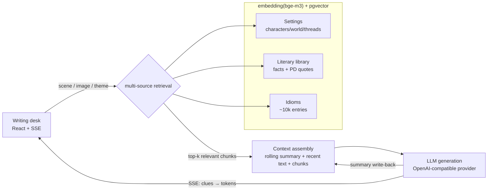

# The Raven Writing Desk · AINovelTool

[中文](README.md) | **English**

> An AI co-writing assistant for long-form **urban-fantasy fiction**. A closed loop of
> *setting library → RAG retrieval → context assembly → LLM generation → rolling-summary
> write-back* attacks the two pains of serial fiction: writer's block and slow drafting —
> extended with **literary citations** and **idiom recommendation** on the same retrieval base.
>
> One engineering thesis throughout: **retrieval-grounded generation — constrain the LLM
> to retrieved, verified knowledge to suppress hallucination.**

License: **MIT**. Built from scratch; borrows feature ideas (not code) from
[MuMuAINovel](https://github.com/xiamuceer-j/MuMuAINovel).


*Night-ink chrome around a paper writing surface, with a muse sidebar (clues / branches /
idioms / citations / foreshadowing). The streamed prose draws its characters, places and
rules from retrieval hits — every detail has a source.*

---

## Headline numbers

| Metric | Result |
| --- | --- |
| Idiom hallucination rate (A/B) | **grounded 0.0% vs raw LLM 20.0%** |
| Retrieval recall | **Recall@6 = 1.000** (30 labeled cases) |
| RAG context compression | **62.5%** vs stuff-everything baseline |
| 10-concurrent retrieval P95 | **962→724ms**, degradation 5.8×→**3.3×** (micro-batching + LRU cache) |
| Retrieval latency / SSE throughput | P95 180ms / 61 events/s |
| Perceived wait | retrieval clues light up at ~0.8s, 2.6–3.3s ahead of the first LLM token |
| Style imitation blind eval | **7 wins / 1 tie / 0 losses** (n=8, counterbalanced LLM judge) |
| Imitation self-check loop | judge feedback lifts style **2→6** in one rewrite; plagiarism gate at 0.0 overlap |
| Judge calibration | real-vs-imitation blind discrimination **5/6** — the judge's verdicts carry weight |
| Precision-mode constraint fulfilment (A/B) | **plain-continue 58.9% → precision 93.0%** (+34 pts; per-constraint must-include/must-not check, n=3) |
| Label-quality gate | **0.396 → 0.789** against a hand-labelled gold set (kappa 0.666); nothing gets built on labels below 0.6 |
| Rhythm prior (A/B, **null result**) | injecting a measured rhythm made output *worse*: distance 1.219 vs 0.619, style 3.25 vs 4.65 → **not shipped** |

## Things that were tried and did not work

Mechanisms that look obviously useful often measure as noise. This project A/Bs
its own ideas and **records the null results, then stops building**:

| Mechanism | The intuition | Measured | Outcome |
| --- | --- | --- | --- |
| Scene-aligned sample recall | same-scene examples read closer | style 5.5 vs 4.7 — inside the noise (n=10) | harness kept, claim dropped |
| Rhythm prior in the prompt | feed the measured rhythm back in | distance **1.219 vs 0.619**, style **3.25 vs 4.65** — both worse | **not wired into generation** |
| Five scene labels | finer categories, better labels | 0.396 accuracy against a human gold set | taxonomy rebuilt; four labels reach 0.789 |

One principle runs through all of it:

> **Concrete, checkable constraints belong in the instruction. Statistics belong in the verification.**

A scene plan's `must_include` / `must_not` are the first kind, and they lifted
fulfilment from 59% to 93%. Chapter-scale statistics ("60% dialogue, sentences
shorten 19%") are the second, and pushing them into a 300-character writing task
made the result worse than no guidance at all.

Labelling has a hard gate too: **below 0.6 accuracy against a human gold set,
nothing may be built on top**. The first label set was stopped there — and note
that the two machine labellers agreed with *each other* (0.675) more than either
agreed with the human, so **a broken taxonomy looks exactly like healthy
agreement until a person is asked**.

## Architecture



## Why this design

The naive approach dumps every character sheet and lore entry into the prompt. For a
multi-character serial that means token blow-up, diluted context, and worse prose. The
RAG layer feeds the model **only what the current scene needs** — smaller, faster,
cheaper, sharper. One `embedding + pgvector` base serves three retrieval sources
(settings / literature / idioms): multi-source hybrid retrieval.

## The loop and the two generation modes

| Mode | Pain it solves | How |
| --- | --- | --- |
| **Continue** | slow drafting | current chapter + retrieved settings → SSE token stream; retrieval clues render at ~0.8s while the first token is in flight |
| **Breakthrough** | writer's block | given the plot state, N divergent next-arc branches, with the retrieval evidence attached |

Plus **foreshadowing tracking** (setup/payoff chapters; open threads enter retrieval so
the generator "remembers" them), a **rolling summary** to bound long-novel context, and
**style imitation** (style samples in the vector store; facts and voice retrieved on
separate paths, samples injected adjacent to the generation point — borrow the voice,
never the content).

### Planning-strength ladder · precision mode (generation-side lift)

Generation shouldn't have a single "strength". Planning strength is a ladder:

- **Exploration** (continue / breakthrough): light planning, high freedom.
- **Precision**: N divergent directions (varied across 6 axes — conflict source /
  agency / reveal order / emotion / turn / open question) → author picks or merges →
  a structured **ScenePlan** whose `must_include` / `must_not` / `end_state` are
  **objectively checkable** constraints → plan-conditioned draft → **per-constraint
  verification**, auto-rewriting on any miss.

This upgrades the imitation self-check loop from "check the voice" to "**check an
explicit plan**" — a genuine agentic loop: `plan → generate → verify → decide →
rewrite`. Verification is an objective present/absent checklist, not another
high-variance 1–10 score. Measured (same chapter, same direction): constraint
fulfilment **plain-continue 58.9% → precision 93.0%**.

### Knowledge state: who is allowed to know what

Suspense is a bookkeeping problem before it is an art problem — a scene breaks
when someone says a thing they have no way of knowing, or when the reader is
handed an answer early. `foreshadowing.status` only records whether a thread is
closed, which cannot express **dramatic irony**: the reader knowing what the
protagonist does not.

So awareness is modelled explicitly: one fact, plus each party's level
(unknown / suspects / knows / believes_false), with **the reader tracked
separately from every character**. When a scene plan is drafted, **program
rules** compile that into must-not constraints:

- reader hasn't reached it → nothing may confirm it
- character below "knows" → they cannot say it (suspecting is not knowing)
- character holding a false belief → they cannot act as if they saw through it

Derivation never calls a model: the rules state exactly, so a model would add
labelling error while removing the guarantee that the constraint appears at all.
Derived lines are stored apart from the author's own, shown with their
provenance, and safe from an accidental edit. Because they speak `must_not` —
a language the pipeline **already verifies** — verification needed no changes.

### Learning voice from edits, not from a reference book

The tool learns a reference author's voice; the better it gets, the less it
sounds like its user. So it captures a signal that was already being produced
and discarded: **every rewrite the author makes before merging a draft**. The
draft box became editable *before* the merge — the one moment "what the model
gave" and "what the author wanted" are still separable, since once text lands in
a chapter the two can never be pulled apart again.

Each `(suggested, accepted)` pair is stored with its texture deltas, where the
**sign** is the preference. Internalisation now stores the **accepted** text:
prose the author reworked is theirs, whatever a judge thought of the draft.

The analyser tries to disprove itself — fit the preference direction on a
training split, then check whether held-out edits move the same way. ~50% means
the edits have nothing to do with texture and no scorer should be built. Verified
on synthetic input: consistent 1.00, contradicted 0.00, pure noise 0.51. Below
20 substantive pairs it refuses to conclude anything.

## v1.1 multi-source retrieval

- **Literary citations** — characters quote and discuss real literature. Two sub-libraries:
  **quotes** (verbatim famous lines, public-domain works only, translator must be PD too)
  and **materials** (composition background / theme readings / plot synopses — facts are
  not copyrightable, so in-copyright works contribute plots and atmosphere while the
  system stays structurally unable to emit their prose). Guarded twice: at ingest and in
  the retrieval SQL. Works carry a genre/theme taxonomy.
- **Idiom recommendation** — describe the image, recall candidates by vector, and the LLM
  selects **only from the recalled list**. It cannot invent idioms: 0.0% vs 20.0% measured.

## Stack

| Layer | Choice | Why |
| --- | --- | --- |
| Backend | FastAPI | async, SSE streaming |
| Database | PostgreSQL + pgvector | relational + vector in one store, no sync to a separate vector DB |
| Embedding | bge-m3 (local) / OpenAI-compatible API | better Chinese recall than multilingual MiniLM; micro-batching + LRU cache fix the CPU concurrency wall |
| LLM | OpenAI-compatible provider abstraction | DeepSeek by default, swappable |
| Frontend | React + Vite, hand-written CSS | "raven writing desk": night-ink chrome, cool paper, cinnabar annotations |

## Quick start

### Docker (recommended)

```bash
cp backend/.env.example backend/.env   # fill LLM_API_KEY etc.
docker compose up --build
# schema auto-applies on first boot; API at http://localhost:8000/docs
```

### Local

```bash
# 1. a pgvector Postgres on host port 5433, then apply the schema
psql "$DATABASE_URL" -f backend/scripts/init_pgvector.sql

# 2. backend
cd backend
python -m venv .venv && source .venv/Scripts/activate
pip install -r requirements.txt
cp .env.example .env
uvicorn app.main:app --reload

# 3. seed data (idioms need chinese-xinhua's idiom.json)
python scripts/seed_literary.py
python scripts/import_idioms.py --source path/to/idiom.json

# 4. frontend
cd ../frontend && npm install && npm run dev   # http://localhost:5173
```

## Eval harness

Every number above is reproducible — see [backend/eval/README.md](backend/eval/README.md).

| Metric | Script |
| --- | --- |
| Retrieval recall | `eval/run_retrieval_eval.py` |
| Token compression | `eval/run_token_eval.py` |
| Generation performance (TTFT / throughput / concurrency) | `eval/run_perf_eval.py` |
| Idiom hallucination A/B | `eval/run_idiom_hallucination_eval.py` |
| Style imitation blind eval | `eval/run_style_eval.py` |
| Judge calibration (real vs imitation) | `eval/run_judge_calibration.py` |
| Precision constraint fulfilment A/B (59%→93%) | `eval/run_refine_ablation.py` |
| Label-agreement gate (accuracy + Cohen's kappa vs human gold) | `eval/run_mode_agreement.py` |
| Rhythm profile (transition matrix / density curves / chapter endings) | `eval/run_rhythm_profile.py` |
| Rhythm prior A/B (**null result**, not shipped) | `eval/run_rhythm_ablation.py` |
| Author-edit preference, with a direction-agreement self-test | `eval/run_override_profile.py` |

> Environment: Windows 11 / CPU inference (bge-m3) / DeepSeek V4 (generate deepseek-v4-flash · judge deepseek-v4-pro) / pgvector HNSW.

## Data model

`projects` · `characters` · `relationships` · `world_settings` · `chapters` ·
`foreshadowing` · `setting_chunks` (vector) · `rolling_summary` ·
`literary_works` · `literary_knowledge` (vector) · `idioms` (vector) ·
`story_facts` (awareness) · `style_overrides` (author edits) ·
`corpus_segments` / `corpus_paragraphs` (rhythm analysis, local-only)

Schema: [backend/scripts/init_pgvector.sql](backend/scripts/init_pgvector.sql).

## Roadmap

- [x] Core loop: settings CRUD → retrieval → continue/breakthrough → rolling summary
- [x] v1.1 multi-source retrieval: literary citations (materials/quotes) + idioms
- [x] "Raven writing desk" frontend (React + live SSE)
- [x] Eval harness: recall / compression / performance / hallucination A/B, all quantified
- [x] Concurrency fix (micro-batching + cache) · foreshadowing system · clues-first streaming
- [x] Style imitation: sample store + dual-path retrieval injection, 7/8 blind-eval wins
- [x] Private style pipeline: epub ingestion (source data never enters the repo) +
      imitation self-check loop (cross-model judge, AI-flavor scoring, n-gram
      plagiarism gate, feedback rewrite) + judge calibration 5/6
- [x] Precision mode (generation-side lift): candidates → ScenePlan (checkable
      constraints) → constraint-verified write + rewrite loop; fulfilment **59%→93%**
      (`run_refine_ablation.py`, agentic loop: plan→generate→verify→rewrite)
- [x] Rhythm modelling: TextTiling segmentation + transition matrix / density curves /
      chapter-ending profile, behind a label-quality gate (0.396→0.789). **Null result** —
      rhythm is measurable but does not transfer through a prompt, so it was not shipped
- [x] Knowledge state: reader and character awareness modelled apart, compiled by program
      rules into must-not constraints that the existing verification loop already covers
- [x] Author-edit capture: drafts editable before merging, `(suggested, accepted)` pairs
      stored, internalisation switched to the author's version; preference analyser
      includes a direction-agreement self-test that can report "no signal"

---

A personal learning / portfolio project; feature ideas inspired by similar open-source
projects, all core implementation independent.
