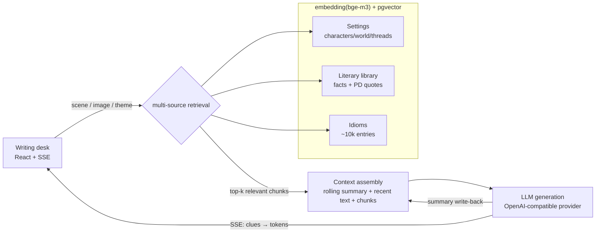

# The Raven Writing Desk · AINovelTool

[中文](README.md) | **English**

> An AI co-writing assistant for long-form **urban-fantasy fiction**. A closed loop of
> *setting library → RAG retrieval → context assembly → LLM generation → rolling-summary
> write-back* attacks the two pains of serial fiction: writer's block and slow drafting —
> extended with **literary citations** and **idiom recommendation** on the same retrieval base.
>
> One engineering thesis throughout: **retrieval-grounded generation — constrain the LLM
> to retrieved, verified knowledge to suppress hallucination.**

License: **MIT**. Built from scratch; borrows feature ideas (not code) from
[MuMuAINovel](https://github.com/xiamuceer-j/MuMuAINovel).


*Night-ink chrome around a paper writing surface, with a muse sidebar (clues / branches /
idioms / citations / foreshadowing). The streamed prose draws its characters, places and
rules from retrieval hits — every detail has a source.*

---

## Headline numbers

| Metric | Result |
| --- | --- |
| Idiom hallucination rate (A/B) | **grounded 0.0% vs raw LLM 20.0%** |
| Retrieval recall | **Recall@6 = 1.000** (30 labeled cases) |
| RAG context compression | **62.5%** vs stuff-everything baseline |
| 10-concurrent retrieval P95 | **962→724ms**, degradation 5.8×→**3.3×** (micro-batching + LRU cache) |
| Retrieval latency / SSE throughput | P95 180ms / 61 events/s |
| Perceived wait | retrieval clues light up at ~0.8s, 2.6–3.3s ahead of the first LLM token |
| Style imitation blind eval | **7 wins / 1 tie / 0 losses** (n=8, counterbalanced LLM judge) |
| Imitation self-check loop | judge feedback lifts style **2→6** in one rewrite; plagiarism gate at 0.0 overlap |
| Judge calibration | real-vs-imitation blind discrimination **5/6** — the judge's verdicts carry weight |

## Architecture



## Why this design

The naive approach dumps every character sheet and lore entry into the prompt. For a
multi-character serial that means token blow-up, diluted context, and worse prose. The
RAG layer feeds the model **only what the current scene needs** — smaller, faster,
cheaper, sharper. One `embedding + pgvector` base serves three retrieval sources
(settings / literature / idioms): multi-source hybrid retrieval.

## The loop and the two generation modes

| Mode | Pain it solves | How |
| --- | --- | --- |
| **Continue** | slow drafting | current chapter + retrieved settings → SSE token stream; retrieval clues render at ~0.8s while the first token is in flight |
| **Breakthrough** | writer's block | given the plot state, N divergent next-arc branches, with the retrieval evidence attached |

Plus **foreshadowing tracking** (setup/payoff chapters; open threads enter retrieval so
the generator "remembers" them), a **rolling summary** to bound long-novel context, and
**style imitation** (style samples in the vector store; facts and voice retrieved on
separate paths, samples injected adjacent to the generation point — borrow the voice,
never the content).

## v1.1 multi-source retrieval

- **Literary citations** — characters quote and discuss real literature. Two sub-libraries:
  **quotes** (verbatim famous lines, public-domain works only, translator must be PD too)
  and **materials** (composition background / theme readings / plot synopses — facts are
  not copyrightable, so in-copyright works contribute plots and atmosphere while the
  system stays structurally unable to emit their prose). Guarded twice: at ingest and in
  the retrieval SQL. Works carry a genre/theme taxonomy.
- **Idiom recommendation** — describe the image, recall candidates by vector, and the LLM
  selects **only from the recalled list**. It cannot invent idioms: 0.0% vs 20.0% measured.

## Stack

| Layer | Choice | Why |
| --- | --- | --- |
| Backend | FastAPI | async, SSE streaming |
| Database | PostgreSQL + pgvector | relational + vector in one store, no sync to a separate vector DB |
| Embedding | bge-m3 (local) / OpenAI-compatible API | better Chinese recall than multilingual MiniLM; micro-batching + LRU cache fix the CPU concurrency wall |
| LLM | OpenAI-compatible provider abstraction | DeepSeek by default, swappable |
| Frontend | React + Vite, hand-written CSS | "raven writing desk": night-ink chrome, cool paper, cinnabar annotations |

## Quick start

### Docker (recommended)

```bash
cp backend/.env.example backend/.env   # fill LLM_API_KEY etc.
docker compose up --build
# schema auto-applies on first boot; API at http://localhost:8000/docs
```

### Local

```bash
# 1. a pgvector Postgres on host port 5433, then apply the schema
psql "$DATABASE_URL" -f backend/scripts/init_pgvector.sql

# 2. backend
cd backend
python -m venv .venv && source .venv/Scripts/activate
pip install -r requirements.txt
cp .env.example .env
uvicorn app.main:app --reload

# 3. seed data (idioms need chinese-xinhua's idiom.json)
python scripts/seed_literary.py
python scripts/import_idioms.py --source path/to/idiom.json

# 4. frontend
cd ../frontend && npm install && npm run dev   # http://localhost:5173
```

## Eval harness

Every number above is reproducible — see [backend/eval/README.md](backend/eval/README.md).

| Metric | Script |
| --- | --- |
| Retrieval recall | `eval/run_retrieval_eval.py` |
| Token compression | `eval/run_token_eval.py` |
| Generation performance (TTFT / throughput / concurrency) | `eval/run_perf_eval.py` |
| Idiom hallucination A/B | `eval/run_idiom_hallucination_eval.py` |
| Style imitation blind eval | `eval/run_style_eval.py` |
| Judge calibration (real vs imitation) | `eval/run_judge_calibration.py` |

> Environment: Windows 11 / CPU inference (bge-m3) / DeepSeek deepseek-chat / pgvector HNSW.

## Data model

`projects` · `characters` · `relationships` · `world_settings` · `chapters` ·
`foreshadowing` · `setting_chunks` (vector) · `rolling_summary` ·
`literary_works` · `literary_knowledge` (vector) · `idioms` (vector)

Schema: [backend/scripts/init_pgvector.sql](backend/scripts/init_pgvector.sql).

## Roadmap

- [x] Core loop: settings CRUD → retrieval → continue/breakthrough → rolling summary
- [x] v1.1 multi-source retrieval: literary citations (materials/quotes) + idioms
- [x] "Raven writing desk" frontend (React + live SSE)
- [x] Eval harness: recall / compression / performance / hallucination A/B, all quantified
- [x] Concurrency fix (micro-batching + cache) · foreshadowing system · clues-first streaming
- [x] Style imitation: sample store + dual-path retrieval injection, 7/8 blind-eval wins
- [x] Private style pipeline: epub ingestion (source data never enters the repo) +
      imitation self-check loop (cross-model judge, AI-flavor scoring, n-gram
      plagiarism gate, feedback rewrite) + judge calibration 5/6

---

A personal learning / portfolio project; feature ideas inspired by similar open-source
projects, all core implementation independent.
