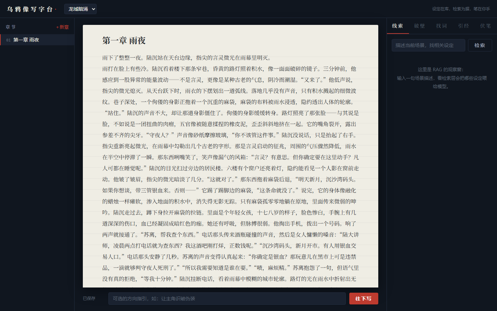
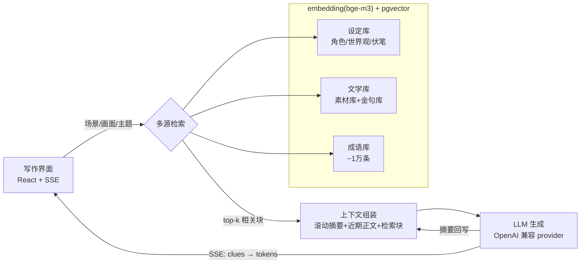

# 乌鸦像写字台 · AINovelTool

**中文** | [English](README.en.md)

> 一个面向**都市幻想长篇小说**的 AI 协作助手。通过
> "设定库 → RAG 检索 → 上下文组装 → AI 生成 → 滚动摘要回写" 的闭环，解决**卡文**与
> **创作速度慢**两大痛点；并在同一套检索底座上扩展**文学引用**与**成语推荐**。
>
> 统一技术主线：**retrieval-grounded generation —— 用检索约束生成，抑制 LLM 幻觉。**

许可证：**MIT**。本项目从零自建，仅借鉴开源项目
[MuMuAINovel](https://github.com/xiamuceer-j/MuMuAINovel) 的功能思路与架构理念，**未复制其源代码**。



*夜色外框 + 稿纸编辑区 + 灵感侧栏（线索 / 破壁 / 找词 / 引经 / 伏笔）。正文由 SSE 流式生成，
角色口癖、地点、规则全部来自检索命中的设定库。*

---

## 核心数字

| 指标 | 结果 |
| --- | --- |
| 成语推荐幻觉率（A/B 对照） | **检索约束 0.0% vs 纯 LLM 20.0%** |
| 检索召回率 | **Recall@6 = 1.000**（30 例标注集） |
| RAG 上下文压缩 | **62.5%**（vs 全量塞 prompt） |
| 10 并发检索 P95 | **962→724ms**，劣化 5.8×→**3.3×**（微批处理 + LRU 缓存） |
| 检索延迟 / SSE 吞吐 | P95 180ms / 61 events/s |
| 感知等待优化 | 检索线索 ~0.8s 先亮，早于首 token 2.6~3.3s |
| 文风模仿盲评 | **7 胜 1 平 0 负**（n=8，LLM 裁判正反双序一致才计胜） |
| 仿写自检环 | 裁判反馈一轮迭代 style **2→6**；复述门 n-gram 重叠 0.0 |
| 裁判校准 | 真原文 vs 仿写盲测分辨率 **5/6**——裁判判断可信 |
| 精修·约束兑现（A/B） | **续写 58.9% → 精修 93.0%**（+34 分；场景计划 must_include/must_not 逐条核对，n=3） |
| 标注质量闸门 | 人工金标准上 **0.396 → 0.789**（kappa 0.666）；不达 0.6 不许继续建模 |
| 节奏先验（A/B，**负结果**） | 注入实测节奏反而更差：节奏距离 1.219 vs 0.619、style 3.25 vs 4.65 → **停止接入** |

## 证伪与止损

看起来显然有用的机制，实测未必成立。这个项目对自己的想法做 A/B，**结论为负也照实提交并停手**：

| 机制 | 直觉 | 实测 | 处置 |
| --- | --- | --- | --- |
| 场景对齐召回 | 用同场景样本更像 | style 5.5 vs 4.7，落在噪声内（n=10） | 保留 harness，不作为卖点 |
| 节奏先验注入 | 把实测节奏写进 prompt 能提升 | 节奏距离 **1.219 vs 0.619**、style **3.25 vs 4.65**，两指标同向恶化 | **不接入生成链路** |
| 五类场景标签 | 分得细一点更准 | 人工金标准上准确率仅 **0.396** | 重做分类学，改四类后 0.789 |

从中提炼出一条贯穿全项目的设计原则：

> **具体、可核对的约束用来指令；统计量用来验收。**

场景计划的 `必须出现 / 不能发生` 属于前者，实测把约束兑现率从 59% 提到 93%；
而"对话占 60%、句长收缩 19%"这类章级统计属于后者，塞进 300 字的生成任务只会适得其反。

标注环节同样设了硬闸门：**分类器在人工金标准上准确率不到 0.6，就不允许在其上继续建模**。
第一版标签正是被这道闸门挡下的——而当时两个机器标注者彼此一致度 0.675，
高于各自与人类的一致度，**分类学的错误在没有人类基准时看起来完全像健康的一致**。

## 架构



## 为什么是这个设计

朴素做法是把所有设定、人物、世界观一股脑塞进 prompt。对一部多人物、长连载的小说，
这会让 token 飙升、上下文被挤占、生成质量下降。

本项目用 **RAG 检索层**只取**当前场景真正相关**的设定喂给模型 —— prompt 更小、更快、
更便宜、更聚焦。同一套 `embedding + pgvector` 底座被三个检索源复用（设定 / 文学 / 成语），
即**多源混合检索**。

## 核心闭环与两种生成模式

| 模式 | 解决痛点 | 说明 |
| --- | --- | --- |
| **续写模式** | 写得慢 | 当前章节 + 检索到的设定，SSE 流式续写；检索线索先亮（~0.8s），正文随后流入 |
| **破壁模式** | 卡文 | 给定剧情状态，一次生成 N 个走向不同的分支卡，响应携带检索依据 |

配套：**伏笔管理**（埋设章/回收章全程跟踪，未回收伏笔自动进入检索，续写时被"想起"）、
**滚动摘要**（控制长篇上下文）、**文风模仿**（文风样本入库，生成时双路检索——
事实与文风分开召回，样本紧邻生成点注入，只借语感不复述内容）。

### 规划强度阶梯 · 精修模式（生成端提升）

生成不该只有一种"强度"。项目把**规划强度**做成一条阶梯：

- **探索**（续写 / 破壁）：弱规划、高自由度，续上语感或发散走向。
- **精修**：多候选走向（在冲突来源 / 主动被动 / 揭示顺序 / 情绪 / 转折 / 悬念 6 维上差异）
  → 作者选 / 合并 → 生成**场景计划**（结构化中间层，其 `必须出现` / `不能发生` / `结尾状态`
  是**客观可校验**的约束）→ 依计划生成 → **逐条核对约束**，不达标带失败项自动重写。

这把仿写自检环从"校验文风"升级为"**校验一份显式计划**"——一个真正的 agentic loop：
`计划 → 生成 → 校验约束 → 决策 → 重写`。校验用**清单式在 / 不在判定**（客观），而非再堆一个
高方差的 1-10 打分。实测（同一章同一走向）：约束兑现率 **续写 58.9% → 精修 93.0%**。

### 知识状态：谁现在能知道什么

悬念在成为艺术问题之前，先是个记账问题——角色说破了他无从得知的事、读者被提前塞了答案，
场景就废了。`foreshadowing.status` 只记"伏笔是否已回收"，表达不了**戏剧性反讽**：读者知道而主角不知道。

于是把认知状态显式建模：一条事实 + 各方对它的认知档位（不知道 / 怀疑 / 知道 / 误信），
**读者与每个人物分开记**。系统在生成场景计划时，用**纯程序规则**把它编译成"不能发生"约束：

- 读者尚不知道 → 禁止直接揭示
- 角色未达"知道" → 禁止让他说破（"怀疑"也不行，那正是怀疑与知道的区别）
- 角色"误信" → 禁止让他表现得已经识破

推导不交给模型：规则简单到可以精确陈述，交给模型只会引入标注误差、并失去"约束一定出现"的保证。
派生约束与作者手写的分开存放，前端标明出处，编辑计划时不会误删。而因为它们说的是
`不能发生` 这门**已被验证的语言**，校验环节不需要任何改动就自动覆盖了它们。

### 记录作者的修改：从改稿里学风格，而不是从参考书

工具学参考作品的语感，学得越好越不像作者自己。所以捕捉一个本来就在产生、却被丢弃的信号：
**作者每次并入前对稿子的改写**。稿件框改为并入前可编辑——那是"模型给的"与"作者要的"
还能分开的唯一时刻，文字一旦进正文就再也拆不出来。

记录 `(建议稿, 接受稿)` 配对与逐项纹理差值（差值的**符号**就是偏好方向）。
「内化」的对象也随之改为**作者接受的版本**：作者动过手的字，无论裁判怎么看那份原稿，都算他的语感。

分析器会**试图否定自己**：在训练集上拟合偏好方向，再看留出集里的修改是否同向。
≈50% 就说明修改与纹理无关、不该据此建打分器。合成数据验证过——同向 1.00、反向 0.00、纯噪声 0.51。
不足 20 对实质改写时拒绝给出任何结论。

## v1.1 多源检索

- **文学引用库**：让角色像有文化的人一样引用、谈论真实文学。分两个子库——
  **金句库**（原文名句，仅公有领域作品，译文须译者也过保护期）与**素材库**（写作背景 /
  主题解读 / 内容概括等事实性知识，可含版权期内作品：事实不受版权保护，作者可引用其情节
  制造氛围，系统结构上无法输出其原文）。双重守卫：入库时强制 + 检索 SQL 兜底。
  作品按体裁/主题分类（诗歌/戏剧/散文/志怪 + 爱情/战争/现实/哲学/成长文学）。
- **成语推荐**：画面描述 → 向量召回候选 → LLM 仅从召回列表内精选并解释，
  不可能编造不存在的成语（A/B 实测 0.0% vs 20.0%）。

## 技术栈

| 层 | 选型 | 理由 |
| --- | --- | --- |
| 后端 | FastAPI | 异步、SSE 流式输出 |
| 数据库 | PostgreSQL + pgvector | 一个库承载关系数据与向量检索，免去独立向量库同步 |
| Embedding | bge-m3（本地）/ OpenAI 兼容 API | 中文语义检索优于多语 MiniLM；微批处理 + LRU 缓存解决 CPU 并发瓶颈 |
| LLM | OpenAI 兼容 provider 抽象 | 默认 DeepSeek，可切任意兼容服务 |
| 前端 | React + Vite，手写 CSS | 「乌鸦像写字台」：夜墨外框 + 冷调稿纸 + 朱砂批注红 |

## 快速开始

### 方式一：Docker（推荐）

```bash
cp backend/.env.example backend/.env   # 填入 LLM_API_KEY 等
docker compose up --build
# 数据库 schema 首次启动自动执行；API 在 http://localhost:8000/docs
```

### 方式二：本地（推荐日常开发：`.\dev.ps1` 一键三终端）

```powershell
# 手动启动 Docker Desktop 后：
.\dev.ps1   # 自动检查 Docker，分三个终端拉起 数据库/后端/前端
```

或手动逐个启动：

```bash
# 1. 起一个带 pgvector 的 Postgres（宿主机端口 5433），执行建表脚本
psql "$DATABASE_URL" -f backend/scripts/init_pgvector.sql

# 2. 后端
cd backend
python -m venv .venv && source .venv/Scripts/activate   # Windows Git Bash
pip install -r requirements.txt
cp .env.example .env                                     # 填写配置
uvicorn app.main:app --reload

# 3. 种子数据（成语 ~1 万条需先下载 chinese-xinhua 的 idiom.json）
python scripts/seed_literary.py
python scripts/import_idioms.py --source path/to/idiom.json

# 4. 前端
cd ../frontend && npm install && npm run dev   # http://localhost:5173
```

## 评测（eval harness）

所有数字可复现，详见 [backend/eval/README.md](backend/eval/README.md)。

| 指标 | 脚本 | 实测结果 |
| --- | --- | --- |
| 检索召回率 | `eval/run_retrieval_eval.py` | **Recall@6 = 1.000**（30 例标注集，均延迟 256ms）|
| Token 压缩 | `eval/run_token_eval.py` | **62.5%**（top-k=6 固定；库越大压缩率越高）|
| 生成性能 | `eval/run_perf_eval.py` | 冷查询 P95 180ms · 缓存命中 ~50ms · 首 token P50 3.1s · 61 events/s |
| 并发优化前后 | `eval/run_perf_eval.py` | 10 并发 P95 962→724ms，劣化 5.8×→3.3× |
| 成语幻觉率 A/B | `eval/run_idiom_hallucination_eval.py` | **0.0% vs 20.0%**（20 场景，真值集 = 31k 词典 ∪ 精选库）|
| 文风模仿盲评 | `eval/run_style_eval.py` | 带样本 vs 无样本 **7 胜 1 平 0 负**（n=8，裁判正反双序一致才计胜，消除位置偏差）|
| 裁判校准 | `eval/run_judge_calibration.py` | 真原文 vs 仿写盲测，裁判分辨率 **5/6**（裁判可信的前提验证）|
| 精修约束兑现 A/B | `eval/run_refine_ablation.py` | **续写 58.9% → 精修 93.0%**（+34 分，3/3 胜，n=3；诚实标注重写循环本轮 0 增益——增益来自计划注入）|
| 标注一致率闸门 | `eval/run_mode_agreement.py` | 人工金标准 50 段；准确率 + Cohen's kappa + 混淆矩阵；**<0.6 停工**（第一版 0.396 被挡下，修正分类学后 0.789 / kappa 0.666）|
| 节奏画像 | `eval/run_rhythm_profile.py` | 转移矩阵（3996 次转移，每格约 250）/ 密度曲线（先按章型分组）/ 章末分布（报原始计数）|
| 节奏先验 A/B（**负结果**）| `eval/run_rhythm_ablation.py` | 节奏距离 **1.219 vs 0.619**（仅胜 2/20）、style **3.25 vs 4.65** → 停止接入 |
| 作者改写偏好 | `eval/run_override_profile.py` | 纹理差值中位数 + **方向一致率**留出验证；≈50% 判定为无信号；<20 对拒绝下结论 |

> 环境：Windows 11 / CPU 推理（bge-m3）/ DeepSeek V4（生成 deepseek-v4-flash·裁判 deepseek-v4-pro）/ pgvector HNSW。

## 数据模型（关键表）

`projects` · `characters` · `relationships` · `world_settings` · `chapters` ·
`foreshadowing` · `setting_chunks`(向量) · `rolling_summary` ·
`literary_works` · `literary_knowledge`(向量) · `idioms`(向量) ·
`story_facts`(认知状态) · `style_overrides`(作者改写) ·
`corpus_segments` / `corpus_paragraphs`(节奏分析，本地私有)

建表 SQL：[backend/scripts/init_pgvector.sql](backend/scripts/init_pgvector.sql)。

## 路线图

- [x] 核心闭环：设定库 CRUD → 检索 → 续写/破壁 → 滚动摘要
- [x] v1.1 多源检索：文学引用（素材库/金句库）+ 成语推荐
- [x] 前端「乌鸦像写字台」（React + SSE 实时渲染）
- [x] eval harness：召回率 / token 压缩 / 生成性能 / 幻觉率 A/B 全部量化
- [x] 并发瓶颈优化（微批处理 + 缓存）· 伏笔系统 · 检索线索先行
- [x] 文风模仿：样本入库 + 双路检索注入，盲评 7/8 胜出
- [x] 私有文风管线：epub 摄取（数据永不入库房）+ 仿写自检环
      （异模型裁判 + AI 味评分 + n-gram 复述门 + 反馈重写）+ 裁判校准 5/6
- [x] 精修模式（生成端提升）：多候选 → 场景计划（可校验约束）→ 校验写作 + 重写闭环；
      约束兑现率 **59%→93%**（`run_refine_ablation.py`，agentic loop：计划→生成→校验→重写）
- [x] 节奏建模：TextTiling 语义切分 + 转移矩阵/密度曲线/章末分布 + 标注质量闸门（0.396→0.789）；
      **结论为负**——节奏可被精确测量，但用提示词传递给模型反而有害，据此停止接入
- [x] 知识状态：读者与人物认知分开建模，程序编译为"不能发生"约束，复用既有校验环
- [x] 作者改写记录：稿件并入前可编辑，`(建议稿, 接受稿)` 配对入库；内化改存作者的版本；
      偏好分析器带方向一致率自证（无信号则拒绝据此建打分器）

---

本项目用于个人学习与作品集展示，借鉴同类开源项目功能思路，核心实现独立完成。
